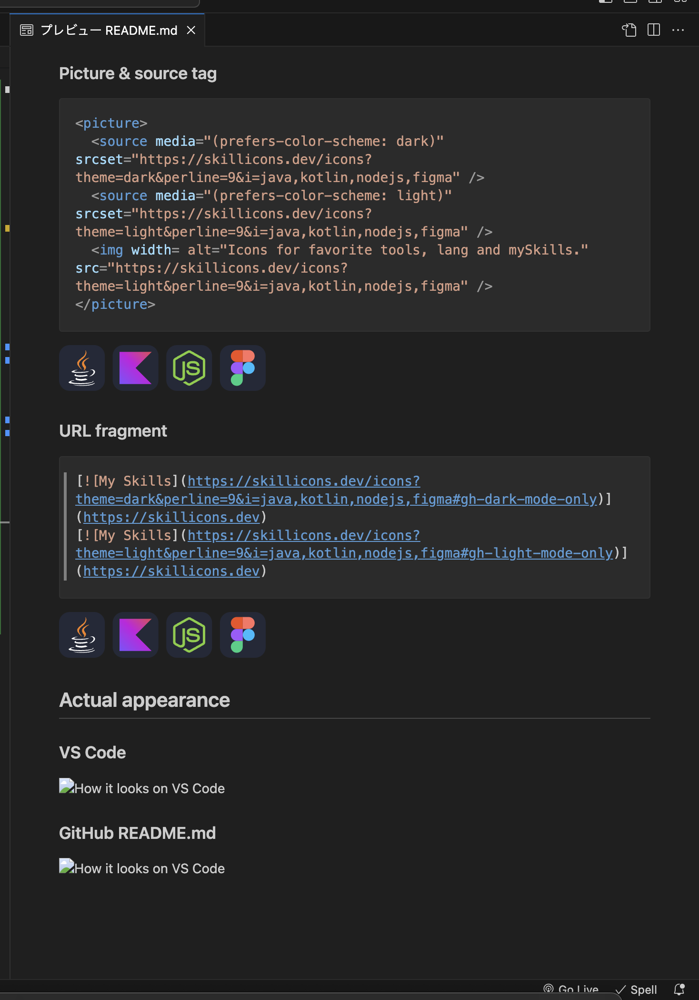
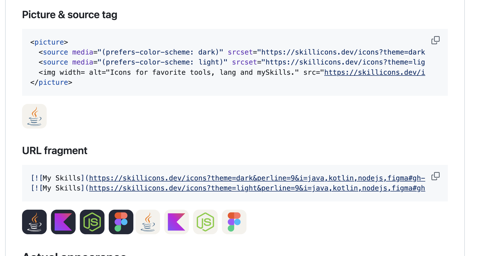

# skill-icons-bug-sample

BUG REPORT用のリポジトリ

## SAMPLE

GitHub profile README.md only shows the first icon when retrieving multiple icons

- When trying to get an image that matches the theme of the site using the picture&source tag, only the first image is taken
- If you use the GitHub URL fragment `#gh-dark-mode-only/#gh-light-mode-only` to display both patterns of images, both images are displayed regardless.
- Note that if you simply use the API in a browser or VS Code viewer, all images are displayed correctly.
- Of course, there is no problem if the sample is written in a way that does not separate the cases as usual.

But this may be a problem with GitHub itself

Translated with DeepL.com (free version)

ORIGINAL: 

GitHubのプロフィールREADME.mdで複数のアイコンを取得した時に1つ目しか表示されない

- picture&sourceタグを使ってサイトのテーマに合わせた画像を取得しようとすると1つ目の画像しか取れない
- GitHubのURLフラグメント`#gh-dark-mode-only/#gh-light-mode-only`を使って両パターンの画像を表示した場合は構わず両方表示されてしまう
- なお、単純にAPIをブラウザ上やVS Codeのビューワーなどで利用した場合は正しくすべて表示される
- 当然、通常のサンプル通りに場合分けを行わない書き方なら問題ない

しかし、これはGitHub自体の問題かもしれない

### Picture & source tag

```md
<picture>
  <source media="(prefers-color-scheme: dark)" srcset="https://skillicons.dev/icons?theme=dark&perline=9&i=java,kotlin,nodejs,figma" />
  <source media="(prefers-color-scheme: light)" srcset="https://skillicons.dev/icons?theme=light&perline=9&i=java,kotlin,nodejs,figma" />
  
</picture>
```

<picture>
  <source media="(prefers-color-scheme: dark)" srcset="https://skillicons.dev/icons?theme=dark&perline=9&i=java,kotlin,nodejs,figma" />
  <source media="(prefers-color-scheme: light)" srcset="https://skillicons.dev/icons?theme=light&perline=9&i=java,kotlin,nodejs,figma" />
  
</picture>

### URL fragment

```md
[](https://skillicons.dev)
[](https://skillicons.dev)
```

[](https://skillicons.dev)
[](https://skillicons.dev)

## Actual appearance

### VS Code



### GitHub README.md


